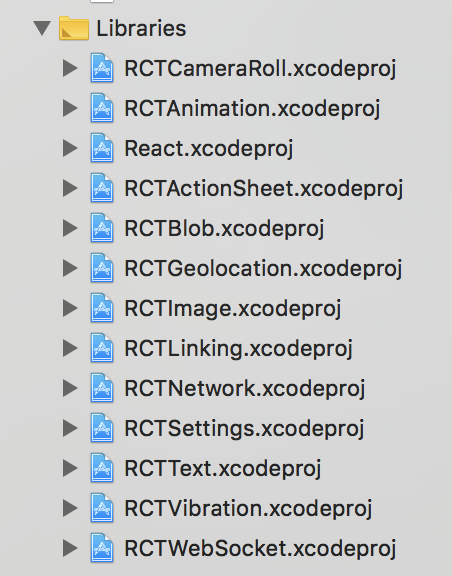

## Aim

- To learn more about React Native components, specifically interaction with the camera roll.
- Upload videos to cloud storage (eg s3)
- Explore transcoding options
- Understand what video formats are suitable for what browsers

## Prerequisites / Assumptions

- using a Mac
- iOS first (developing with the simulator)
- `react-native-cli` is installed and ready to go
- Xcode is installed (and command line tools)

### Create a vanilla React Native app

```bash
$ react-native init vanilla
```

To start the web server side of things:

```bash
$ react-native start
```

To run the app in the iOS simulator:

```bash
$ react-native run-ios
```

### Version control

Now might be a good time to init a git repo and make your initial commit.

```bash
$ git init
$ git add .
$ git commit -m "Initial commit of vanilla React Native app."
```

### Camera roll

So you want to access the camera roll.  There is an API in `react-native`, [CameraRoll](https://facebook.github.io/react-native/docs/cameraroll.html).

In App.js you will want to include `CameraRoll` from `react-native`.

```javascript
import { ..., CameraRoll, ... } from 'react-native'
```

You won't be able to use this straight away as you need to do a couple of things first.

1. The `CameraRoll` API requires the `RCTCameraRoll` library to be linked.  Read more about [linking](https://facebook.github.io/react-native/docs/linking-libraries-ios).
1. Your app needs to ask for the user's permission to access the camera roll.

### Linking RCTCameraRoll

1. Find `~/project-dir/node_modules/react-native/Libraries/CameraRoll/RCTCameraRoll.xcodeproj`
1. In your open project in Xcode, expand Libraries in the Project navigator
    
1. Drag and drop `RCTCameraRoll.xcodeproj` to the list of Libraries
1. In the top menubar go to Build Phases
1. Expand "Link Binary With Libraries"
1. Click the + to add a new one
1. Select `libRCTCameraRoll.a`

### Permissions

1. In the top menubar go to "Info"
1. Expand "Custom iOS Target Properties"
1. Hover over any of them and click the little +
1. Select "Privacy - Location When In Use Usage Description"
1. Add a description as to why your app requires camera roll permissions

And we're done with Xcode!
